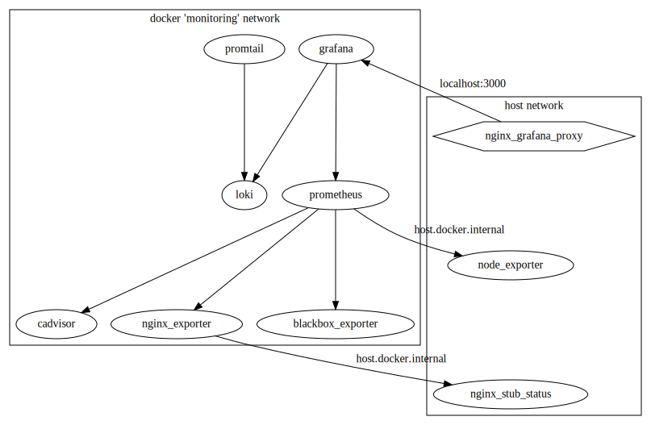

## Схема мониторинга




```
# update
dot -Tsvg img/monitoring.dot -o img/monitoring.dot.svg
```

## Подготовка нового сервера

1. Соединиться с новым Debian-сервером по SSH и выполнить следующие действия:
    1. На сервере в файле `/etc/ssh/sshd_config` поменять `Port 22` на рандомный высокий порт (`shuf -i 49152-65535`).
    1. Выполнить `service sshd restart`. **НЕ ЗАКРЫВАТЬ SSH-сессию!**
    1. Добавить **В СВОЙ ЛОКАЛЬНЫЙ** в `~/.ssh/config` следующую запись (пользователь `admin` будет создан далее). 
        ```
        Host pandora
            HostName <ip>
            Port <port>
            User admin
        ```
    1. Убедиться, что команда `ssh root@pandora` работает, только потом закрыть первую SSH-сессию.
1. Если у Вас локально нет файлов `~/.ssh/id_*`, сгенерировать себе ключевую пару: `ssh-keygen -t ed25519`
1. Сгенерировать ключевую пару для пользователя `ci`: `ssh-keygen -t ed25519 -C ci -f ci@pandora_ed25519`:
    1. Приватную часть SSH-ключа сохранить в GitHub Secrets в переменную `DEPLOY_TARGET_KEY`.
    1. Уничтожить приватную часть ключа командой `shred -u ci@pandora_ed25519`.
    1. Публичную часть SSH-ключа сохранить в переменную [ci_user_key](./ansible/_inventory.yml).
1. Запустить Ansible Playbook [common.yml](./ansible/common.yml) от рута:
    ```
    ansible-playbook -v -u root --become-method su -i ./server/ansible/_inventory.yml ./server/ansible/common.yml
    ```
1. Если плэйбук не заработает, починить. Автор этого документа, вероятно, может помочь.
1. Добавить секреты в GitHub Secrets:
    * `DEPLOY_TARGET_HOST`
    * `DEPLOY_TARGET_PORT`
    * `DEPLOY_TARGET_IDENTITY` (вывод команды `ssh-keyscan -p [port] -H [host]`)
    * `DEPLOY_TARGET_KEY` (уже должен быть добавлен)
    * `REGISTRY_HOST` (адрес container registry)
    * `REGISTRY_PASSWORD` (токен доступа к container registry)
1. Зайти на сервер командой `ssh pandora`:
    1. Добавить секреты в файл `/home/ci/.env`: дополнить список переменных из [.env.example](../.env.example) переменной `PANDORA_IMAGES_PREFIX`.
    1. Задеплоить приложение через GitHub Actions. Если что-то пошло не так, починить и дополнить инструкцию/плэйбук.
    1. Получить SSL-сертификаты через `certbot`.
